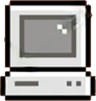

# User Guidelines

# What is Focus Husky
Focus Husky is a desktop productivity app designed to help users stay focused and motivated using a gamified Pomodoro system. The app includes a Pomodoro timer, virtual pet, task tracker, and a virtual pet marketplace. As users complete focus sessions, they earn stars that can be used to unlock and customize animated pets and accessories.

The application includes the following navigation pages:

# Features: 
### 📊 Dashboard: 
The main home page where you can view:

- A percentage of your weekly activity level
- Total hours worked for the week
- Number of tasks completed
- A list of your remaining tasks

After each Pomodoro session, your progress is updated here.  
In the **top-right corner**, you can click the **Start Pomodoro Timer** button to launch the Pomodoro widget.

#### ⏲️ Pomodoro Timer Widget

Once launched, the widget displays:
- A countdown timer for your current Pomodoro session
- Your **virtual pet** cheering you on
- **Play** and **Pause** buttons to control the timer
- Above the timer you should see the following buttons:

<table>
  <tr>
    <td>
      
    </td>
    <td>
      <p><strong>Settings:</strong> Navigates to the application dashboard where you can restart your Pomodoro timer.<br>
      <code>~ Work in Progress</code></p>
    </td>
  </tr>
  <td>
      
    </td>
    <td>
      <p><strong>Calendar:</strong> Navigates to the application dashboard where you can restart your Pomodoro timer.<br>
      <code>~ Work in Progress</code></p>
    </td>
  <tr>
    <td>
      
    </td>
    <td>
      <p><strong>Tasks:</strong> Navigates to the application dashboard where you can restart your Pomodoro timer.<br>
      <code>~ Work in Progress</code></p>
    </td>
  </tr>
</table>

---
### 🐶 My Pet:
On the pet navigation page, you can see your pet's current statistics, including:

- **Mood**
- **Happiness level**
- **Energy level**
- **Cleanliness level**

These levels gradually drop as you study, and your pet's animation reflects the current stats.

To improve your pet’s mood and raise its stats, you can interact with it by either:

- Clicking on the virtual pet and selecting an interaction  
- Navigating to the pet page and choosing an interaction

You can **feed**, **play with**, or **groom** your pet, and the animation will reflect your chosen interaction.

Additionally, there is a **Productivity Actions** category to complete a timer, and a **Settings** category that allows auto-care for your pet while studying to minimize distractions.

---

### ✅ My Tasks:
On the tasks navigation page, you can sync your tasks with Canvas by entering your personal token.  
*( ⚠️Currently only for testing; integration with Google Calendar is in progress.)*

After logging in, you'll see a **to-do list** displaying all your uncompleted tasks. You can:

- Edit tasks  
- Delete tasks  
- Mark tasks as completed

There is also a separate tab where you can view **completed tasks**.

Additionally, there is an **Activity** tab available.  
*(⚠️ In progress)*

---

### 🛒 Marketplace:

The marketplace allows you to customize your experience by spending stars on pets, accessories, timers, sounds, and task templates.

- You will start with **200 stars** by default when you first use the application.
- Stars can be earned by completing **Pomodoro timer sessions** and **tasks** *(⚠️ In progress)*.
- You **cannot** purchase items you already own, and stars are **non-refundable** once spent.

#### 🐶 Pets
- You will start with a **Husky** as your default pet.
- After purchasing new pets, you can **equip** the pet of your choice from the marketplace. *(⚠️ In progress)*

#### 🎀 Accessories
- Purchased accessories will become available for your pet to wear. *(⚠️ In progress)*

#### ⏱️ Timers
- Customize your Pomodoro timer by purchasing **new colors** and **templates**. *(⚠️ In progress)*

#### 🔊 Sounds
- Buy unique sounds to play when your Pomodoro timer ends. *(⚠️ In progress)*

#### ✅ Task Templates
- You can also purchase **pre-built task templates** to quickly add common tasks. *(⚠️ In progress)*

---

# Why Use Focus Husky?
- Boost your productivity with the proven **Pomodoro technique**.
- Track your **tasks and study progress** in an engaging, visual way.
- Stay motivated with **gamified elements** like a virtual pet that reacts to your focus.
- Earn stars for completing tasks and use them to **collect pets, accessories, sounds, and more**.
- Customize your experience and watch your pet thrive as you stay on track.

# How to install the software
To install the software you first need to have VS code downloaded. Once you have it installed you need to click clone git repository. Now you need to go to out git repository, click the green code button, copy the HTTPS link, and then past it into VS code. Once that is done you can run our application in the terminal. 

1. Install the following prerequisites if you don't have them already
   
   - Visual Studio Code: https://code.visualstudio.com/
   - Node.js & npm: https://nodejs.org/
   - Git: https://git-scm.com/
3. Clone the repository
   
   - Open VS Code and then run:
   ```bash
   git clone https://github.com/NamLe05/Focus-Husky.git
   ```
   - Or click the green "Code" button on the GitHub repo and copy the HTTPS link
4. Navigate to the project folder on VS code using the following command
   
   ```bash
   cd Focus-Husky/
   ```
5. Install dependencies
   
    ```bash
   npm install
    ```

---


If you don’t want to run the app using code, you can simply download and launch the pre-built version of Focus Husky from GitHub.

✅ Steps:

Click this link to go to our GitHub Releases page:👉 (https://github.com/NamLe05/Focus-Husky/releases/tag/v.1.0.0-beta)

- Scroll down to the “Assets” section of the latest release.

- Download the .exe file

- Drag the downloaded file or folder to your local computer (like your Desktop or Downloads folder).

- Double-click the file you just moved:

- The app should open in a new window using Electron — you're now ready to start focusing with Focus Husky!


# How to run the software?
. To start the application:
   - First ensure you are in client:
      ```bash
     #first ensure you are in the client directory
     cd client/
     ```
      ```bash
     npm start
      ```

# How to report a bug
If you find a bug or issue while using Focus Husky, you can report it on Github

✅ Steps:

Go to the Issues tab on our GitHub repository:
👉 https://github.com/NamLe05/Focus-Husky/issues

- Click "New Issue" to create a bug report.

In the issue:
- Give it a clear title that summarizes the bug.

- Describe the bug in detail:

- What the bug is

- Where the bug occurs

- Steps to potientially take to fix the bug

- Label the issue as a "bug" using the "Labels" tab on the right side.

- Assign the issue to yourself or someone else on the team, so it's tracked and resolved.

# Known bugs

- Pomodoro timer is not completely transparent 
- Still need to link the Pet's metrics based on the pomodoro sessions and tasks
- Need to have accessories show up on the pet when users purchase items in the marketplace
